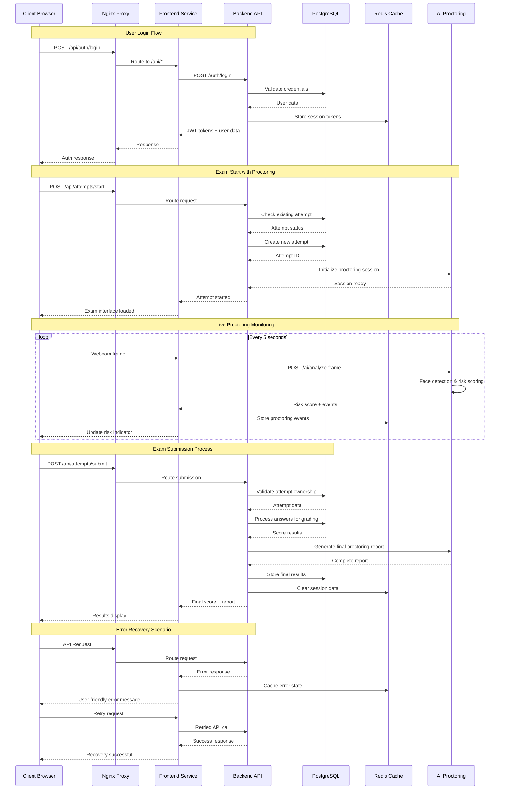
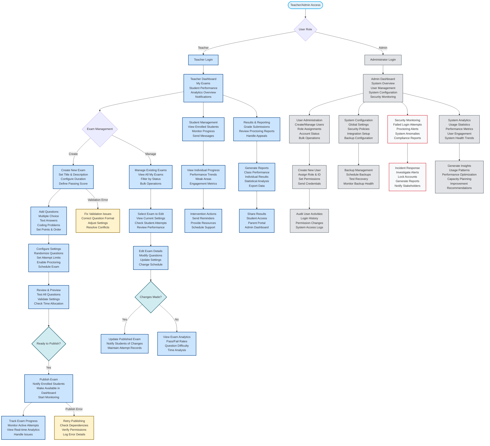

# 🎯 Secure Exam Platform - Enterprise AI-Powered Assessment System

A comprehensive, production-ready examination platform with AI proctoring, real-time analytics, and enterprise-grade monitoring.

## 1. Project Overview

The Secure Exam Platform is a **mission-critical enterprise assessment system** designed for educational institutions requiring **zero-trust security**, **AI-powered proctoring**, and **complete observability**. Built with modern microservices architecture, it handles thousands of concurrent exam sessions while maintaining **academic integrity** through advanced anti-cheating mechanisms.

### Key Features

#### Complete Examination System
- **Full CRUD Operations**: Create, edit, delete, and manage exams
- **Multiple Question Types**: MCQ, text, coding questions with automatic grading
- **Timer & Auto-Submit**: Configurable exam duration with automatic submission
- **Advanced Grading**: Automatic scoring with manual override capabilities

#### AI Proctoring System
- **Real-time Face Detection**: Advanced computer vision monitoring
- **Risk Scoring Algorithm**: Comprehensive 0-100 risk assessment
- **Session Management**: Redis-backed proctoring sessions
- **Event Logging**: Complete audit trail of suspicious activities
- **Tab Switch Detection**: Browser behavior monitoring

#### Advanced Analytics & Dashboards
- **Topic-wise Performance**: Detailed analysis by subject/topic
- **Student Progress Tracking**: Historical performance metrics
- **Interactive Charts**: Real-time visualizations using Recharts
- **Leaderboards**: Competitive performance tracking
- **Weak Topic Identification**: Automated learning gap detection

#### Real-time Notifications
- **WebSocket Integration**: Instant event notifications
- **Role-based Filtering**: Targeted notifications for students/teachers
- **Persistent Storage**: Database-backed notification history
- **Event Types**: New exams, exam published, proctoring alerts

#### Enterprise Deployment
- **Docker Containerization**: Multi-service orchestration
- **Kubernetes Ready**: Production-grade K8s manifests
- **One-Command Deployment**: Smart DevOps automation script
- **Health Monitoring**: Comprehensive service health checks

#### Monitoring & Observability
- **Prometheus Metrics**: HTTP requests, response times, error rates
- **Grafana Dashboards**: System metrics, API performance, AI proctoring
- **Custom Business Metrics**: Exam-specific monitoring
- **Alert Integration**: Ready for production alerting

## 2. System Architecture

### High-Level Architecture Overview

The Secure Exam Platform follows a **microservices architecture pattern** with **defense-in-depth security** and **observability-first design**. Each service is independently deployable, scalable, and monitored.

```
                    Internet Traffic
                           |
                    +-------v-------+
                    |     Nginx     |  (Reverse Proxy, SSL Termination)
                    |   (Port 80)    |  - Rate Limiting
                    |   (Port 443)   |  - CORS Headers
                    +-------+-------+  - Security Headers
                            |
        +-------------------+-------------------+
        |                   |                   |
+-------v-------+   +-------v-------+   +-------v-------+
|   Frontend    |   |    Backend     |   |  AI Proctoring |
|   (React)     |   |   (Node.js)    |   |   (Python)      |
|   Port: 3005  |   |   Port: 4005   |   |   Port: 5005    |
|   SPA + Auth  |   |   API + Auth   |   |   CV + ML       |
+-------+-------+   +-------+-------+   +-------+-------+
        |                   |                   |
        |                   |                   |
        +-------------------+-------------------+
                            |
            +---------------+---------------+
            |                               |
    +-------v-------+               +-------v-------+
    |  PostgreSQL    |               |     Redis      |
    |  (Port: 5432) |               |  (Port: 6379) |
    |  ACID + Index |               |  Session Cache |
    +-------+-------+               +-------+-------+
            |                               |
            +---------------+---------------+
                            |
                +-----------+-----------+
                |                       |
        +-------v-------+       +-------v-------+
        |  Prometheus    |       |    Grafana    |
        |  (Port: 9092) |       |  (Port: 3002) |
        |   Metrics     |       |  Dashboards   |
        +---------------+       +---------------+
```

### Component Deep Dive

#### Frontend Service (React + TypeScript)
- **Purpose**: Single-page application for user interaction
- **Key Responsibilities**:
  - User authentication and session management
  - Exam interface with anti-cheating measures
  - Real-time dashboard updates
  - WebSocket client for live notifications
- **Why React**: Component-based architecture, excellent TypeScript support, vast ecosystem
- **Production Features**: Code splitting, lazy loading, service workers

#### Backend Service (Node.js + Express)
- **Purpose**: Core business logic and API gateway
- **Key Responsibilities**:
  - JWT authentication and authorization
  - Exam management and attempt tracking
  - Real-time WebSocket server
  - Prometheus metrics collection
- **Why Node.js**: Non-blocking I/O for concurrent exam sessions, JavaScript ecosystem consistency
- **Production Features**: Connection pooling, request validation, comprehensive error handling

#### AI Proctoring Service (Python + FastAPI)
- **Purpose**: Computer vision-based exam monitoring
- **Key Responsibilities**:
  - Real-time face detection and tracking
  - Cheating behavior analysis
  - Risk scoring algorithms
  - Frame capture and processing
- **Why Python**: Superior ML/CV ecosystem (OpenCV, NumPy), async FastAPI performance
- **Production Features**: GPU acceleration support, frame buffering, privacy compliance

#### PostgreSQL Database
- **Purpose**: Primary data store with ACID compliance
- **Key Responsibilities**:
  - User and exam data persistence
  - Attempt tracking with unique constraints
  - Audit trail and compliance data
  - Complex query support for analytics
- **Why PostgreSQL**: Strong consistency, JSON support, advanced indexing, proven reliability
- **Production Features**: Connection pooling, read replicas, point-in-time recovery

#### Redis Cache
- **Purpose**: High-performance caching and session storage
- **Key Responsibilities**:
  - JWT token blacklisting
  - Real-time session state
  - API response caching
  - WebSocket connection management
- **Why Redis**: Sub-millisecond latency, rich data structures, persistence options
- **Production Features**: Cluster mode, memory optimization, eviction policies

#### Nginx Reverse Proxy
- **Purpose**: Edge routing and security gateway
- **Key Responsibilities**:
  - SSL termination and HTTP/2
  - Load balancing and health checks
  - Rate limiting and DDoS protection
  - Static asset serving
- **Why Nginx**: Battle-tested performance, minimal resource usage, extensive feature set
- **Production Features**: HTTP/3 support, dynamic configuration, advanced caching

#### Prometheus + Grafana Stack
- **Purpose**: Comprehensive observability and monitoring
- **Key Responsibilities**:
  - Metrics collection and storage
  - Alert generation and notification
  - Performance visualization
  - Business intelligence dashboards
- **Why This Stack**: Industry standard, cloud-native, extensive integration support
- **Production Features**: Long-term storage, high availability, automated alerting

### Data Flow Architecture

```
User Request Flow:
1. User Browser -> Nginx (SSL/Security) -> Frontend/Backend
2. Authentication -> JWT Token -> Redis Session Store
3. Exam Start -> Backend DB -> Unique Attempt ID
4. Proctoring -> AI Service -> Risk Scoring -> DB Logs
5. Real-time Updates -> WebSocket -> Frontend Dashboard

Monitoring Flow:
1. All Services -> Prometheus Metrics -> Time Series DB
2. Prometheus Query Engine -> Grafana Dashboards
3. Alert Manager -> Notification Channels
```

### Security Architecture

```
Defense in Depth Layers:
1. Network Layer: Nginx (WAF, Rate Limiting, DDoS Protection)
2. Application Layer: JWT Auth, Input Validation, CORS
3. Data Layer: PostgreSQL (Row Security), Redis (Encryption)
4. Monitoring Layer: Prometheus (Security Metrics), Audit Logs
5. Infrastructure Layer: Docker Isolation, Kubernetes RBAC
```

## 3. Tech Stack + Design Rationales

### Frontend Technology Stack

| Technology | Purpose | Why Chosen |
|-------------|---------|------------|
| **React 18** | UI Framework | Component-based architecture, excellent TypeScript support, vast ecosystem, server-side rendering capabilities |
| **TypeScript** | Type Safety | Compile-time error detection, better IDE support, improved code maintainability for enterprise applications |
| **Vite** | Build Tool | Lightning-fast HMR, optimized production builds, modern ES modules, plugin ecosystem |
| **TailwindCSS** | Styling | Utility-first approach, consistent design system, reduced CSS bundle size, rapid prototyping |
| **React Router v6** | Navigation | Declarative routing, code splitting, role-based route protection, excellent TypeScript support |
| **Axios** | HTTP Client | Promise-based API, request/response interceptors, automatic token refresh, error handling |

### Backend Technology Stack

| Technology | Purpose | Why Chosen |
|-------------|---------|------------|
| **Node.js 20** | Runtime | Non-blocking I/O for concurrent exam sessions, JavaScript ecosystem consistency, enterprise LTS support |
| **Express.js** | Web Framework | Minimalist, battle-tested, extensive middleware ecosystem, excellent TypeScript support |
| **TypeScript** | Type Safety | Compile-time error detection, better IDE support, improved code maintainability |
| **PostgreSQL 16** | Database | ACID compliance, JSON support, advanced indexing, proven reliability for critical data |
| **Redis 7** | Cache/Subsession | Sub-millisecond latency, rich data structures, persistence options, clustering support |
| **JWT** | Authentication | Stateless tokens, cross-service compatibility, standard security practices |
| **Prometheus Client** | Metrics | Industry standard, cloud-native, extensive integration support |

### AI Proctoring Technology Stack

| Technology | Purpose | Why Chosen |
|-------------|---------|------------|
| **Python 3.11** | Runtime | Superior ML/CV ecosystem, async performance, extensive scientific computing libraries |
| **FastAPI** | Web Framework | Native async support, automatic OpenAPI docs, high performance, excellent TypeScript interop |
| **OpenCV** | Computer Vision | Industry standard CV library, extensive algorithms, hardware acceleration support |
| **NumPy** | Numerical Computing | High-performance array operations, GPU acceleration, scientific computing foundation |
| **Pillow** | Image Processing | Simple API, format support, memory-efficient processing |

### Infrastructure & DevOps Stack

| Technology | Purpose | Why Chosen |
|-------------|---------|------------|
| **Docker** | Containerization | Consistent environments, dependency isolation, rapid scaling, ecosystem support |
| **Docker Compose** | Local Orchestration | Simple multi-service management, development parity, volume management |
| **Kubernetes** | Production Orchestration | Self-healing, auto-scaling, service discovery, rolling updates, cloud-agnostic |
| **Nginx** | Reverse Proxy | Battle-tested performance, minimal resource usage, extensive feature set |
| **Prometheus** | Metrics Collection | Time-series database, powerful query language, service discovery, alerting |
| **Grafana** | Visualization | Rich dashboard ecosystem, data source flexibility, alert management, enterprise features |

### Design Philosophy

#### 1. **Observability-First Design**
- Every service emits structured metrics
- Comprehensive logging with correlation IDs
- Distributed tracing for request flows
- Real-time dashboards for operational visibility

#### 2. **Security by Default**
- Zero-trust network architecture
- Principle of least privilege
- Defense in depth strategy
- Automated security scanning

#### 3. **High Availability**
- Stateless service design
- Graceful degradation
- Circuit breakers and timeouts
- Health checks and auto-recovery

#### 4. **Performance Optimization**
- Database connection pooling
- Redis caching strategies
- CDN for static assets
- Lazy loading and code splitting

#### 5. **Developer Experience**
- Comprehensive TypeScript support
- Hot reload in development
- Automated testing pipelines
- Clear documentation and examples

## 4. Application Workflow

### Complete User Journey

#### 1. User Registration & Authentication
```
Flow:
1. User submits registration form (email, password, role)
2. Backend validates input, hashes password (bcrypt, 10 rounds)
3. User stored in PostgreSQL with role assignment
4. Login request validates credentials
5. JWT access token (15min) + refresh token (7d) issued
6. Tokens stored in Redis for session management
7. Frontend receives tokens, stores securely (httpOnly cookies)

Security Features:
- Rate limiting on auth endpoints (5 req/s)
- Password strength validation
- Account lockout after failed attempts
- Token refresh with rotation
```

#### 2. Exam Discovery & Selection
```
Flow:
1. Student dashboard fetches available exams
2. Backend queries PostgreSQL with user permissions
3. Exams filtered by role, schedule, and enrollment
4. Real-time updates via WebSocket for new exams
5. Teacher sees created exams, can edit/publish

Authorization:
- Students: See only published/enrolled exams
- Teachers: See own created exams
- Admins: See all platform exams
```

#### 3. Exam Attempt Initiation (Idempotent Logic)
```
Critical Business Logic - Idempotent Attempt Start:

1. Student clicks "Start Exam"
2. Frontend calls POST /api/attempts/start with examId
3. Backend checks for existing active attempt:
   ```sql
   SELECT * FROM exam_attempts 
   WHERE exam_id = $1 AND user_id = $2 AND status = 'in_progress'
   ```
4. IF exists: Return existing attempt (HTTP 200)
   - Prevents duplicate attempts
   - Enables exam resume after disconnection
   - Maintains session continuity
5. IF not exists: Create new attempt (HTTP 201)
   - Insert with unique constraint protection
   - Start timer, allocate attempt ID
   - Trigger AI proctoring initialization

Database Constraint:
CREATE UNIQUE INDEX unique_active_attempt
ON exam_attempts (exam_id, user_id)
WHERE status = 'in_progress';
```

#### 4. AI Proctoring Activation
```
Real-time Monitoring Flow:
1. Backend notifies AI service of new attempt
2. Frontend requests webcam access
3. Video frames captured every 5 seconds
4. Frames sent to AI service for analysis
5. AI service detects:
   - Face presence and position
   - Multiple faces detection
   - Head movement patterns
   - Background changes
6. Risk score calculated (0-100)
7. High-risk events trigger alerts
8. All events logged to audit trail

Privacy Features:
- Frames processed locally, no cloud storage
- Automatic deletion after 24 hours
- User consent required
- GDPR compliance built-in
```

#### 5. Exam Session Management
```
Live Session Flow:
1. WebSocket connection established
2. Timer countdown managed server-side
3. Answer auto-save every 30 seconds
4. Anti-cheating monitors:
   - Tab switching detection
   - Copy/paste prevention
   - Right-click blocking
   - Fullscreen enforcement
5. Real-time proctoring alerts
6. Session state synchronized across browser tabs

Recovery Mechanisms:
- Automatic reconnection on network loss
- State restoration from Redis
- Answer recovery from auto-saves
- Attempt resume capability
```

#### 6. Exam Submission & Grading
```
Submission Flow:
1. Student submits or timer expires
2. Backend validates attempt ownership
3. Answers processed for automatic grading:
   - MCQ: Exact match comparison
   - Text: Keyword-based scoring
   - Coding: Test case execution
4. Final score calculated
5. Proctoring report generated
6. Results stored with audit trail
7. Notifications sent to stakeholders

Grading Logic:
- Points per question configurable
- Partial credit for text answers
- Cheating penalties applied
- Grade boundaries customizable
```

### Error Handling & Recovery

#### Network Resilience
- Automatic reconnection with exponential backoff
- Local state persistence during disconnection
- Conflict resolution on reconnection
- Graceful degradation for poor connections

#### Data Integrity
- Database transactions for critical operations
- Unique constraints prevent duplicates
- Audit trails for all modifications
- Point-in-time recovery capability

#### User Experience
- Loading states and progress indicators
- Error messages with actionable guidance
- Auto-save functionality
- Session timeout warnings

## 5. Database Design

### Core Schema Architecture

#### Users Table - Identity Management
```sql
CREATE TABLE users (
    id UUID PRIMARY KEY DEFAULT gen_random_uuid(),
    email VARCHAR(255) UNIQUE NOT NULL,
    password VARCHAR(255) NOT NULL, -- bcrypt hash
    name VARCHAR(255) NOT NULL,
    role VARCHAR(50) NOT NULL CHECK (role IN ('student', 'teacher', 'admin')),
    student_id VARCHAR(50) UNIQUE, -- Institutional ID
    teacher_id VARCHAR(50) UNIQUE, -- Faculty ID
    registration_number VARCHAR(50) UNIQUE, -- System-generated
    created_at TIMESTAMP DEFAULT CURRENT_TIMESTAMP,
    updated_at TIMESTAMP DEFAULT CURRENT_TIMESTAMP,
    last_login TIMESTAMP,
    is_active BOOLEAN DEFAULT true
);

-- Indexes for performance
CREATE INDEX idx_users_email ON users(email);
CREATE INDEX idx_users_role ON users(role);
CREATE INDEX idx_users_registration ON users(registration_number);
```

#### Exams Table - Assessment Definition
```sql
CREATE TABLE exams (
    id UUID PRIMARY KEY DEFAULT gen_random_uuid(),
    title VARCHAR(255) NOT NULL,
    description TEXT,
    duration_minutes INTEGER NOT NULL CHECK (duration_minutes > 0),
    scheduled_at TIMESTAMP,
    end_time TIMESTAMP,
    status VARCHAR(50) DEFAULT 'draft' CHECK (status IN ('draft', 'published', 'active', 'completed')),
    teacher_id UUID REFERENCES users(id) ON DELETE CASCADE,
    passing_score INTEGER DEFAULT 50 CHECK (passing_score >= 0 AND passing_score <= 100),
    max_attempts INTEGER DEFAULT 1,
    created_at TIMESTAMP DEFAULT CURRENT_TIMESTAMP,
    updated_at TIMESTAMP DEFAULT CURRENT_TIMESTAMP
);

-- Indexes for query optimization
CREATE INDEX idx_exams_teacher ON exams(teacher_id);
CREATE INDEX idx_exams_status ON exams(status);
CREATE INDEX idx_exams_scheduled ON exams(scheduled_at);
```

#### Questions Table - Assessment Content
```sql
CREATE TABLE questions (
    id UUID PRIMARY KEY DEFAULT gen_random_uuid(),
    exam_id UUID REFERENCES exams(id) ON DELETE CASCADE,
    text TEXT NOT NULL,
    type VARCHAR(50) NOT NULL CHECK (type IN ('mcq', 'text', 'coding')),
    options JSONB, -- For MCQ: ["option1", "option2", ...]
    correct_answer TEXT,
    explanation TEXT,
    points INTEGER DEFAULT 1 CHECK (points > 0),
    order_index INTEGER,
    created_at TIMESTAMP DEFAULT CURRENT_TIMESTAMP
);

-- Indexes for performance
CREATE INDEX idx_questions_exam ON questions(exam_id);
CREATE INDEX idx_questions_type ON questions(type);
CREATE INDEX idx_questions_order ON questions(exam_id, order_index);
```

#### Exam Attempts Table - Session Tracking
```sql
CREATE TABLE exam_attempts (
    id UUID PRIMARY KEY DEFAULT gen_random_uuid(),
    exam_id UUID REFERENCES exams(id) ON DELETE CASCADE,
    user_id UUID REFERENCES users(id) ON DELETE CASCADE,
    status VARCHAR(50) DEFAULT 'in_progress' CHECK (status IN ('in_progress', 'submitted', 'expired', 'abandoned')),
    started_at TIMESTAMP DEFAULT CURRENT_TIMESTAMP,
    submitted_at TIMESTAMP,
    time_left_seconds INTEGER,
    score INTEGER,
    total_points INTEGER,
    percentage DECIMAL(5,2),
    cheating_warnings INTEGER DEFAULT 0,
    proctoring_score INTEGER DEFAULT 0, -- AI risk score
    answers JSONB, -- Complete answer set
    ip_address INET,
    user_agent TEXT,
    created_at TIMESTAMP DEFAULT CURRENT_TIMESTAMP,
    updated_at TIMESTAMP DEFAULT CURRENT_TIMESTAMP
);

-- CRITICAL: Unique constraint for idempotent attempts
CREATE UNIQUE INDEX unique_active_attempt
ON exam_attempts (exam_id, user_id)
WHERE status = 'in_progress';

-- Performance indexes
CREATE INDEX idx_attempts_user ON exam_attempts(user_id);
CREATE INDEX idx_attempts_exam ON exam_attempts(exam_id);
CREATE INDEX idx_attempts_status ON exam_attempts(status);
CREATE INDEX idx_attempts_submitted ON exam_attempts(submitted_at);
```

#### Answers Table - Individual Responses
```sql
CREATE TABLE answers (
    id UUID PRIMARY KEY DEFAULT gen_random_uuid(),
    attempt_id UUID REFERENCES exam_attempts(id) ON DELETE CASCADE,
    question_id UUID REFERENCES questions(id) ON DELETE CASCADE,
    answer TEXT NOT NULL,
    is_correct BOOLEAN,
    points_earned INTEGER DEFAULT 0,
    time_spent_seconds INTEGER,
    created_at TIMESTAMP DEFAULT CURRENT_TIMESTAMP,
    updated_at TIMESTAMP DEFAULT CURRENT_TIMESTAMP,
    
    -- Prevent duplicate answers per attempt/question
    UNIQUE(attempt_id, question_id)
);

-- Indexes for analytics
CREATE INDEX idx_answers_attempt ON answers(attempt_id);
CREATE INDEX idx_answers_question ON answers(question_id);
CREATE INDEX idx_answers_correct ON answers(is_correct);
```

#### Proctoring Logs Table - Security Events
```sql
CREATE TABLE proctoring_logs (
    id UUID PRIMARY KEY DEFAULT gen_random_uuid(),
    attempt_id UUID REFERENCES exam_attempts(id) ON DELETE CASCADE,
    event_type VARCHAR(50) NOT NULL CHECK (event_type IN (
        'face_detected', 'face_lost', 'multiple_faces', 
        'tab_switch', 'fullscreen_exit', 'copy_paste',
        'suspicious_movement', 'no_face_detected'
    )),
    risk_score INTEGER DEFAULT 0 CHECK (risk_score >= 0 AND risk_score <= 100),
    frame_data TEXT, -- Base64 encoded frame (for critical events)
    metadata JSONB, -- Additional event context
    timestamp TIMESTAMP DEFAULT CURRENT_TIMESTAMP,
    created_at TIMESTAMP DEFAULT CURRENT_TIMESTAMP
);

-- Indexes for security analysis
CREATE INDEX idx_proctoring_attempt ON proctoring_logs(attempt_id);
CREATE INDEX idx_proctoring_type ON proctoring_logs(event_type);
CREATE INDEX idx_proctoring_timestamp ON proctoring_logs(timestamp);
CREATE INDEX idx_proctoring_risk ON proctoring_logs(risk_score);
```

### Key Design Decisions

#### 1. UUID Primary Keys
- **Why**: Global uniqueness across distributed systems
- **Benefits**: No sequence conflicts, security through obscurity, merge-friendly
- **Trade-offs**: Larger storage, less human-readable

#### 2. JSONB for Flexible Data
- **Why**: Schema evolution without migrations
- **Benefits**: Store complex data structures, queryable content
- **Use Cases**: Question options, exam answers, proctoring metadata

#### 3. Unique Active Attempt Constraint
- **Why**: Business logic enforcement at database level
- **Benefits**: Prevents concurrent attempts, enables idempotent operations
- **Implementation**: Partial unique index with WHERE clause

#### 4. Audit Trail Design
- **Why**: Complete compliance and forensic capability
- **Benefits**: Event reconstruction, dispute resolution, pattern analysis
- **Features**: Immutable logs, correlation IDs, metadata capture

#### 5. Performance Optimization
- **Why**: Scale to thousands of concurrent users
- **Strategies**: Strategic indexing, connection pooling, query optimization
- **Monitoring**: Slow query logs, index usage analysis

## 6. DevOps & Deployment

### Docker Compose Architecture

#### Production-Ready Service Configuration
```yaml
# Key Production Features:
- Health checks for all services
- Restart policies for auto-recovery
- Resource limits for stability
- Volume mounts for persistence
- Network segmentation for security
- Environment variable management
```

#### Service Dependencies & Startup Order
```yaml
Dependency Chain:
1. postgres -> Database foundation
2. redis -> Cache layer
3. backend -> Depends on postgres+redis
4. ai-proctoring -> Independent service
5. frontend -> Depends on backend
6. prometheus -> Metrics collection
7. grafana -> Visualization
8. nginx -> Entry point (depends on all)
```

### Environment Configuration Strategy

#### Production Environment Variables
```bash
# Security Configuration
JWT_SECRET=256-bit-production-key
JWT_REFRESH_SECRET=256-bit-refresh-key
CORS_ORIGIN=https://secure-exam.duckdns.org

# Database Configuration
DB_HOST=postgres
DB_NAME=exam_platform
DB_USER=postgres
DB_PASSWORD=secure-production-password

# Monitoring Configuration
PROMETHEUS_RETENTION=200h
GRAFANA_ADMIN_PASSWORD=secure-grafana-password

# AI Proctoring Configuration
AI_MODEL_PATH=/app/models
FRAME_CAPTURE_INTERVAL=5000
RISK_THRESHOLD=75
```

#### Development vs Production Differences
- **Development**: Hot reload, debug logs, local database
- **Production**: Optimized builds, structured logs, managed database
- **Security**: Production uses secrets management, development uses env files

### Health Check Implementation

#### Service-Specific Health Endpoints
```bash
# Backend Health Check
GET /health
Response: {"status": "healthy", "timestamp": "...", "services": {"db": "up", "redis": "up"}}

# AI Proctoring Health Check  
GET /health
Response: {"status": "healthy", "models": {"face_detection": "loaded"}, "gpu": "available"}

# Frontend Health Check
GET /health
Response: {"status": "healthy", "build": "production", "version": "1.0.0"}

# Database Health Check
pg_isready -U postgres -d exam_platform

# Redis Health Check
redis-cli ping
```

### Deployment Strategies

#### 1. Local Development
```bash
# Quick start for developers
docker compose up --build
# Access: http://localhost:3005
```

#### 2. Production Deployment (Azure VM)
```bash
# Single-command production deployment
./deploy-and-validate.sh

# Steps performed:
1. Clean existing containers
2. Build production images
3. Start all services
4. Wait for health checks
5. Run comprehensive validation
6. Display access URLs and credentials
```

#### 3. Kubernetes Deployment
```bash
# Production Kubernetes deployment
kubectl apply -f k8s/namespace.yaml
kubectl apply -f k8s/configmaps.yaml
kubectl apply -f k8s/secrets.yaml
kubectl apply -f k8s/postgres.yaml
kubectl apply -f k8s/redis.yaml
kubectl apply -f k8s/backend.yaml
kubectl apply -f k8s/frontend.yaml
kubectl apply -f k8s/ai-proctoring.yaml
kubectl apply -f k8s/monitoring.yaml
kubectl apply -f k8s/ingress.yaml
```

#### 4. Helm Chart Deployment
```bash
# Deploy with Helm for production
helm install exam-platform ./helm/exam-platform \
  --namespace exam-platform \
  --create-namespace \
  --set frontend.domain=secure-exam.duckdns.org \
  --set backend.domain=api.secure-exam.duckdns.org \
  --set ingress.enabled=true \
  --set monitoring.enabled=true
```

### CI/CD Pipeline Architecture

#### GitHub Actions Workflow
```yaml
Pipeline Stages:
1. Code Quality
   - ESLint + Prettier checks
   - TypeScript compilation
   - Security scanning (Snyk)
   
2. Testing
   - Unit tests (Jest)
   - Integration tests (Supertest)
   - E2E tests (Playwright)
   
3. Build & Security
   - Docker image building
   - Image vulnerability scanning
   - SBOM generation
   
4. Deploy
   - Staging deployment
   - Automated validation
   - Production promotion
```

### Monitoring & Observability Setup

#### Prometheus Metrics Collection
```yaml
# Service Metrics Collected:
- HTTP request count and duration
- Error rates by endpoint
- Database connection pool status
- Redis cache hit/miss ratios
- AI proctoring processing time
- Container resource usage
- Business metrics (exam attempts, scores)
```

#### Grafana Dashboard Configuration
```yaml
# Pre-configured Dashboards:
1. System Overview - Service health, resource usage
2. Application Performance - API metrics, response times
3. Business Intelligence - Exam statistics, user analytics
4. Security Monitoring - Proctoring alerts, risk scores
5. Infrastructure - Database, Redis, network metrics
```

### Backup & Disaster Recovery

#### Database Backup Strategy
```bash
# Automated Daily Backups
0 2 * * * pg_dump -U postgres exam_platform | gzip > backup_$(date +%Y%m%d).sql.gz

# Point-in-Time Recovery
pg_basebackup -U postgres -D /backup/base -Ft -z -P
```

#### Configuration Backup
- Git version control for all manifests
- Environment variables in secret management
- Automated configuration export daily

### Scaling Strategies

#### Horizontal Scaling
```yaml
# Kubernetes HPA Configuration
apiVersion: autoscaling/v2
kind: HorizontalPodAutoscaler
metadata:
  name: backend-hpa
spec:
  scaleTargetRef:
    apiVersion: apps/v1
    kind: Deployment
    name: backend
  minReplicas: 2
  maxReplicas: 10
  metrics:
  - type: Resource
    resource:
      name: cpu
      target:
        type: Utilization
        averageUtilization: 70
```

#### Database Scaling
- **Read Replicas**: For analytics and reporting
- **Connection Pooling**: PgBouncer for high concurrency
- **Partitioning**: By date for large exam tables

### Security Hardening

#### Container Security
```yaml
# Security Features:
- Non-root user execution
- Read-only filesystem where possible
- Resource limits (CPU, memory)
- Seccomp profiles
- AppArmor/SELinux policies
```

#### Network Security
```yaml
# Network Policies:
- Service-to-service communication only
- Ingress restrictions by IP
- Egress filtering for security
- VPN access for admin functions
```

## 7. Monitoring & Observability

### Comprehensive Monitoring Strategy

#### Prometheus Metrics Architecture
```yaml
# Metrics Collection Hierarchy
1. Infrastructure Metrics
   - CPU, Memory, Disk, Network usage
   - Container resource utilization
   - Node exporter system metrics

2. Application Metrics  
   - HTTP request count and duration
   - Error rates by endpoint and status
   - Database connection pool status
   - Redis cache hit/miss ratios
   - JWT token validation metrics

3. Business Metrics
   - Exam attempts per minute
   - Active user sessions
   - Proctoring risk score distribution
   - Question response times
   - Grade distribution analytics

4. Security Metrics
   - Failed authentication attempts
   - Rate limiting triggers
   - Proctoring alert frequency
   - Suspicious activity patterns
```

#### Grafana Dashboard Suite
```yaml
# Pre-configured Production Dashboards

1. **System Overview Dashboard**
   - Service health status
   - Resource utilization trends
   - Container performance metrics
   - Network latency monitoring

2. **Application Performance Dashboard**
   - API response time percentiles
   - Request throughput analysis
   - Error rate breakdown
   - Database query performance

3. **Business Intelligence Dashboard**
   - Active exam sessions
   - Student engagement metrics
   - Grade distribution charts
   - Proctoring effectiveness

4. **Security Monitoring Dashboard**
   - Authentication failure patterns
   - Proctoring alert heatmap
   - Risk score distribution
   - Geographic access analysis

5. **Infrastructure Health Dashboard**
   - PostgreSQL performance
   - Redis cluster status
   - AI service GPU utilization
   - Storage capacity planning
```

#### Alert Configuration
```yaml
# Critical Alerts (Immediate Notification)
- Service down (any component)
- Database connection failures
- Authentication system compromised
- High error rates (>5%)
- Memory usage >90%

# Warning Alerts (Email Notification)
- High response times (>2s)
- Resource usage >80%
- Unusual proctoring patterns
- Failed backup attempts

# Info Alerts (Dashboard Only)
- New user registrations
- Exam completions
- System deployments
```

## 3. System Use Cases

### Figure 3.1 – System Use Case Diagram

```mermaid
graph TD
    %% User Roles
    Student[Student User]
    Teacher[Teacher User]
    Admin[Administrator]
    
    %% Authentication Use Cases
    UC1[User Registration]
    UC2[User Login]
    UC3[Password Reset]
    UC4[Logout]
    
    %% Student Use Cases
    UC5[View Available Exams]
    UC6[Start Exam Attempt]
    UC7[Submit Exam Answers]
    UC8[View Results]
    UC9[View Progress Dashboard]
    UC10[Receive Notifications]
    
    %% Teacher Use Cases
    UC11[Create Exam]
    UC12[Edit Exam]
    UC13[Publish Exam]
    UC14[Manage Questions]
    UC15[View Student Performance]
    UC16[Generate Reports]
    UC17[Monitor Active Exams]
    
    %% Admin Use Cases
    UC18[User Management]
    UC19[System Configuration]
    UC20[View System Analytics]
    UC21[Backup & Recovery]
    UC22[Security Monitoring]
    
    %% AI Proctoring Use Cases
    UC23[Face Detection]
    UC24[Risk Scoring]
    UC25[Alert Generation]
    UC26[Audit Trail Management]
    
    %% Connections
    Student --> UC1
    Student --> UC2
    Student --> UC3
    Student --> UC4
    Student --> UC5
    Student --> UC6
    Student --> UC7
    Student --> UC8
    Student --> UC9
    Student --> UC10
    
    Teacher --> UC1
    Teacher --> UC2
    Teacher --> UC3
    Teacher --> UC4
    Teacher --> UC11
    Teacher --> UC12
    Teacher --> UC13
    Teacher --> UC14
    Teacher --> UC15
    Teacher --> UC16
    Teacher --> UC17
    
    Admin --> UC1
    Admin --> UC2
    Admin --> UC3
    Admin --> UC4
    Admin --> UC18
    Admin --> UC19
    Admin --> UC20
    Admin --> UC21
    Admin --> UC22
    
    UC23 --> UC24
    UC24 --> UC25
    UC25 --> UC26
    
    %% System Boundaries
    subgraph "AI Proctoring System"
        UC23
        UC24
        UC25
        UC26
    end
    
    subgraph "Core Examination System"
        UC5
        UC6
        UC7
        UC8
        UC11
        UC12
        UC13
        UC14
        UC15
        UC16
        UC17
    end
    
    subgraph "User Management System"
        UC1
        UC2
        UC3
        UC4
        UC18
    end
    
    subgraph "Administrative System"
        UC19
        UC20
        UC21
        UC22
    end
```



**Explanation:**
The System Use Case Diagram illustrates all major user interactions with the Secure Exam Platform. The diagram is organized by user roles (Student, Teacher, Admin) and shows how each role interacts with different system functionalities. The AI Proctoring System operates as a separate subsystem that monitors exam sessions in real-time. This diagram helps stakeholders understand the complete scope of system capabilities and user journeys.

## 4. System Architecture

### Figure 4.1 – High-Level System Architecture Diagram

```mermaid
graph TB
    %% External Users
    Users[End Users<br/>(Students/Teachers/Admins)]
    
    %% Internet Gateway
    Internet[Internet]
    DNS[DNS: secure-exam.duckdns.org]
    
    %% Load Balancer & Security
    LB[Nginx Load Balancer<br/>Port: 80/443<br/>SSL Termination<br/>Rate Limiting<br/>Security Headers]
    
    %% Application Services
    Frontend[Frontend Service<br/>React + TypeScript<br/>Port: 3005<br/>Static Assets<br/>Client-side Logic]
    
    Backend[Backend Service<br/>Node.js + Express<br/>Port: 4005<br/>API Gateway<br/>Business Logic<br/>WebSocket Server]
    
    AI[AI Proctoring Service<br/>Python + FastAPI<br/>Port: 5005<br/>Computer Vision<br/>Risk Assessment<br/>Frame Analysis]
    
    %% Data Layer
    PG[PostgreSQL Database<br/>Port: 5432<br/>ACID Compliance<br/>Primary Data Store<br/>Audit Trail]
    
    Redis[Redis Cache<br/>Port: 6379<br/>Session Store<br/>Token Blacklist<br/>API Caching]
    
    %% Monitoring Stack
    Prometheus[Prometheus<br/>Port: 9092<br/>Metrics Collection<br/>Time Series DB<br/>Alert Management]
    
    Grafana[Grafana<br/>Port: 3002<br/>Dashboards<br/>Visualization<br/>Alert Interface]
    
    NodeExporter[Node Exporter<br/>Port: 9100<br/>System Metrics<br/>Resource Monitoring]
    
    %% Connections
    Users --> Internet
    Internet --> DNS
    DNS --> LB
    
    LB --> Frontend
    LB --> Backend
    LB --> AI
    
    Backend --> PG
    Backend --> Redis
    Backend --> Prometheus
    
    AI --> Redis
    AI --> Prometheus
    
    Frontend --> Backend
    Frontend --> AI
    
    Prometheus --> Grafana
    NodeExporter --> Prometheus
    
    %% Styling
    classDef user fill:#e1f5fe,stroke:#0175c2,stroke-width:2px
    classDef gateway fill:#f8f9fa,stroke:#343a40,stroke-width:3px
    classDef service fill:#e3f2fd,stroke:#0ea5e9,stroke-width:2px
    classDef data fill:#fff3cd,stroke:#856404,stroke-width:2px
    classDef monitoring fill:#d1ecf1,stroke:#0c5460,stroke-width:2px
    
    class Users user
    class LB gateway
    class Frontend,Backend,AI service
    class PG,Redis data
    class Prometheus,Grafana,NodeExporter monitoring
```

**Explanation:**
The High-Level System Architecture Diagram shows the complete microservices architecture with clear separation of concerns. The system follows a layered approach with security at the edge (Nginx), application services in the middle tier, data persistence at the bottom, and comprehensive monitoring throughout. This architecture ensures scalability, maintainability, and observability while maintaining security through defense-in-depth principles.

### Figure 4.2 – Entity-Relationship (ER) Diagram

```mermaid
erDiagram
    %% User Entity
    USERS {
        uuid id PK
        string email UK
        string password
        string name
        string role
        string student_id UK
        string teacher_id UK
        string registration_number UK
        timestamp created_at
        timestamp updated_at
        timestamp last_login
        boolean is_active
    }
    
    %% Exam Entity
    EXAMS {
        uuid id PK
        string title
        text description
        integer duration_minutes
        timestamp scheduled_at
        timestamp end_time
        string status
        uuid teacher_id FK
        integer passing_score
        integer max_attempts
        timestamp created_at
        timestamp updated_at
    }
    
    %% Question Entity
    QUESTIONS {
        uuid id PK
        uuid exam_id FK
        text text
        string type
        jsonb options
        text correct_answer
        text explanation
        integer points
        integer order_index
        timestamp created_at
    }
    
    %% Exam Attempts Entity
    EXAM_ATTEMPTS {
        uuid id PK
        uuid exam_id FK
        uuid user_id FK
        string status
        timestamp started_at
        timestamp submitted_at
        integer time_left_seconds
        integer score
        integer total_points
        decimal percentage
        integer cheating_warnings
        integer proctoring_score
        jsonb answers
        inet ip_address
        text user_agent
        timestamp created_at
        timestamp updated_at
    }
    
    %% Answers Entity
    ANSWERS {
        uuid id PK
        uuid attempt_id FK
        uuid question_id FK
        text answer
        boolean is_correct
        integer points_earned
        integer time_spent_seconds
        timestamp created_at
        timestamp updated_at
    }
    
    %% Proctoring Logs Entity
    PROCTORING_LOGS {
        uuid id PK
        uuid attempt_id FK
        string event_type
        integer risk_score
        text frame_data
        jsonb metadata
        timestamp timestamp
        timestamp created_at
    }
    
    %% Relationships
    USERS ||--o{ EXAMS : "creates"
    USERS ||--o{ EXAM_ATTEMPTS : "attempts"
    EXAMS ||--o{ QUESTIONS : "contains"
    EXAMS ||--o{ EXAM_ATTEMPTS : "has attempts"
    EXAM_ATTEMPTS ||--o{ ANSWERS : "contains"
    QUESTIONS ||--o{ ANSWERS : "answered in"
    EXAM_ATTEMPTS ||--o{ PROCTORING_LOGS : "monitored by"
    
    %% Relationship Constraints
    USERS {
        role IN ('student', 'teacher', 'admin')
        status IN ('draft', 'published', 'active', 'completed')
        type IN ('mcq', 'text', 'coding')
        event_type IN ('face_detected', 'face_lost', 'multiple_faces', 'tab_switch', 'fullscreen_exit', 'copy_paste', 'suspicious_movement', 'no_face_detected')
    }
    
    %% Unique Constraints
    EXAM_ATTEMPTS {
        UNIQUE(exam_id, user_id) WHERE status = 'in_progress'
    }
    
    ANSWERS {
        UNIQUE(attempt_id, question_id)
    }
```

**Explanation:**
The Entity-Relationship Diagram shows the complete database schema with all entities, attributes, and relationships. The design uses UUID primary keys for global uniqueness, JSONB for flexible data storage, and proper foreign key relationships to maintain data integrity. The unique constraints on exam attempts and answers prevent duplicate submissions and ensure business logic enforcement at the database level.

### Figure 4.3 – API Request-Response Flow Diagram



**Explanation:**
The API Request-Response Flow Diagram illustrates the complete lifecycle of API interactions from authentication through exam submission and error handling. It shows how requests flow through the Nginx proxy, between services, and how Redis provides caching and session management. The diagram also demonstrates the real-time nature of AI proctoring with continuous frame analysis and the robust error recovery mechanisms built into the system.

### Figure 4.4 – Authentication and Session Flow

```mermaid
flowchart TD
    %% Initial State
    Start([User Access Attempt]) --> AuthChoice{Authentication Method}
    
    %% Registration Branch
    AuthChoice -->|New User| Registration[User Registration]
    Registration --> ValidateReg[Validate Input<br/>Email Format<br/>Password Strength<br/>Role Selection]
    ValidateReg -->|Valid| CreateAccount[Create User Account<br/>Hash Password<br/>Assign Role<br/>Generate Registration Number]
    CreateAccount --> StoreUser[Store in PostgreSQL<br/>Send Verification Email]
    StoreUser --> RegSuccess[Registration Successful<br/>Login Required]
    
    %% Login Branch
    AuthChoice -->|Existing User| Login[User Login]
    Login --> ValidateCreds[Validate Credentials<br/>Check Account Status<br/>Verify Password Hash]
    ValidateCreds -->|Valid| GenerateTokens[Generate JWT Tokens<br/>Access Token (15min)<br/>Refresh Token (7days)]
    GenerateTokens --> StoreTokens[Store in Redis<br/>Create Session Record<br/>Update Last Login]
    StoreTokens --> LoginSuccess[Login Successful<br/>Redirect to Dashboard]
    
    %% Token Refresh Flow
    LoginSuccess --> ActiveSession[Active Session]
    ActiveSession --> TokenCheck{Access Token Valid?}
    TokenCheck -->|Expired| RefreshToken[Use Refresh Token<br/>Generate New Access Token<br/>Invalidate Old Token]
    RefreshToken -->|Success| ActiveSession
    RefreshToken -->|Failed| ForceLogout[Clear All Tokens<br/>Redirect to Login]
    
    %% Session Management
    ActiveSession -->|Valid| ApiAccess[API Access with JWT<br/>Validate Each Request<br/>Check Token Blacklist]
    ApiAccess --> RateLimit[Rate Limiting Check<br/>5 req/s for auth<br/>10 req/s for API]
    RateLimit -->|Within Limit| ProcessRequest[Process Request<br/>Update Activity Log<br/>Return Response]
    RateLimit -->|Exceeded| RateLimitError[Return 429 Error<br/>Log Rate Limit Event<br/>Temporary Block]
    
    %% Security Features
    ProcessRequest --> SecurityCheck[Security Monitoring<br/>Failed Login Attempts<br/>Suspicious Activity<br/>Session Anomalies]
    SecurityCheck -->|Threat Detected| SecurityAction[Lock Account<br/>Revoke Tokens<br/>Notify Admin<br/>Log Security Event]
    SecurityAction --> ForceLogout
    
    %% Logout Flow
    ActiveSession -->|User Action| Logout[User Logout]
    Logout --> ClearSession[Clear Redis Session<br/>Blacklist Tokens<br/>Update Logout Time]
    ClearSession --> LogoutSuccess[Logout Successful<br/>Redirect to Login]
    
    %% Error States
    ValidateCreds -->|Invalid| LoginError[Invalid Credentials<br/>Increment Failed Counter<br/>Temporary Lock if >5 attempts]
    ValidateReg -->|Invalid| RegError[Registration Error<br/>Return Validation Messages<br/>Suggest Corrections]
    
    %% Final States
    LoginSuccess --> Dashboard[Role-Based Dashboard]
    RegSuccess --> Login
    LogoutSuccess --> Start
    ForceLogout --> Start
    RegError --> Registration
    LoginError --> Login
    
    %% Styling
    classDef start fill:#d4edda,stroke:#155724,stroke-width:2px
    classDef process fill:#cce5ff,stroke:#004085,stroke-width:2px
    classDef success fill:#d1ecf1,stroke:#0c5460,stroke-width:2px
    classDef error fill:#f8d7da,stroke:#721c24,stroke-width:2px
    classDef security fill:#f8f9fa,stroke:#343a40,stroke-width:3px
    
    class Start start
    class Registration,ValidateReg,CreateAccount,StoreUser,Login,ValidateCreds,GenerateTokens,StoreTokens,TokenCheck,RefreshToken,ApiAccess,RateLimit,ProcessRequest process
    class RegSuccess,LoginSuccess,ActiveSession,Logout,ClearSession,LogoutSuccess,Dashboard success
    class LoginError,RegError,ForceLogout,RateLimitError error
    class SecurityCheck,SecurityAction security
```

**Explanation:**
The Authentication and Session Flow diagram provides a comprehensive view of the security architecture. It covers user registration, login with JWT tokens, automatic token refresh, session management, rate limiting, and security monitoring. The flow demonstrates defense-in-depth security with multiple layers of protection including account lockout mechanisms, token blacklisting, and real-time threat detection.

## 6. User Experience & Workflows

### Figure 6.1 – Student User Flow Diagram

```mermaid
flowchart TD
    %% Entry Points
    Start([Student Access]) --> LoginChoice{Already Registered?}
    
    %% Registration Flow
    LoginChoice -->|No| StudentReg[Student Registration]
    StudentReg --> ValidateStudent[Validate Student Data<br/>Email + Institution ID<br/>Password Strength<br/>Parent Consent if Minor]
    ValidateStudent -->|Valid| CreateStudent[Create Student Account<br/>Generate Student ID<br/>Send Welcome Email]
    CreateStudent --> StudentDashboard[Student Dashboard]
    
    %% Login Flow
    LoginChoice -->|Yes| StudentLogin[Student Login]
    StudentLogin --> ValidateLogin[Validate Credentials<br/>Check Enrollment Status<br/>Verify Account Active]
    ValidateLogin -->|Success| StudentHome[Student Home Dashboard<br/>View Available Exams<br/>Check Schedule<br/>See Progress]
    
    %% Exam Discovery
    StudentHome --> BrowseExams[Browse Available Exams<br/>Filter by Subject<br/>Check Prerequisites<br/>View Exam Details]
    BrowseExams --> SelectExam[Select Exam<br/>Review Instructions<br/>Check Time Requirements<br/>Verify Enrollment]
    SelectExam --> PrepareExam[Exam Preparation<br/>System Check<br/>Webcam Test<br/>Network Stability Test]
    
    %% Exam Taking Flow
    PrepareExam --> StartExam[Start Exam Attempt<br/>Initialize Proctoring<br/>Begin Timer<br/>Lock Down Browser]
    StartExam --> ExamInterface[Active Exam Interface<br/>Display Questions<br/>Auto-save Progress<br/>Show Timer]
    
    %% Real-time Monitoring
    ExamInterface --> ProctoringActive[AI Proctoring Active<br/>Face Detection<br/>Tab Switch Monitoring<br/>Risk Score Display<br/>Real-time Warnings]
    
    %% Question Navigation
    ExamInterface --> NavigateQuestions[Navigate Questions<br/>Previous/Next<br/>Review Flagged<br/>Save Progress]
    NavigateQuestions --> AnswerQuestions[Answer Questions<br/>Multiple Choice<br/>Text Input<br/>Code Editor]
    
    %% Exam Completion
    AnswerQuestions --> SubmitChoice{Ready to Submit?}
    SubmitChoice -->|Manual| SubmitExam[Submit Exam<br/>Final Validation<br/>Confirm Submission]
    SubmitChoice -->|Time Expired| AutoSubmit[Auto-submit on Timer<br/>Save All Progress<br/>Generate Attempt Record]
    
    %% Post-Exam Flow
    SubmitExam --> ProctoringReport[Generate Proctoring Report<br/>Calculate Final Risk Score<br/>Compile Event Log]
    AutoSubmit --> ProctoringReport
    ProctoringReport --> StoreResults[Store Results in Database<br/>Update Student Progress<br/>Trigger Notifications]
    StoreResults --> ViewResults[View Results<br/>Score Breakdown<br/>Correct Answers<br/>Proctoring Summary]
    
    %% Learning Analytics
    ViewResults --> Analytics[Learning Analytics<br/>Topic Performance<br/>Weak Areas Identification<br/>Progress Trends<br/>Recommendations]
    Analytics --> StudyPlan[Personalized Study Plan<br/>Targeted Practice<br/>Resource Suggestions<br/>Improvement Tracking]
    
    %% Ongoing Engagement
    StudentDashboard --> Notifications[Real-time Notifications<br/>New Exam Published<br/>Results Available<br/>Teacher Messages]
    StudentDashboard --> ProgressTrack[Progress Tracking<br/>Historical Performance<br/>Achievement Badges<br/>Leaderboard Position]
    
    %% Error Handling
    StartExam -->|Technical Issues| ExamRecovery[Exam Recovery<br/>Auto-save Restoration<br/>Session Resume<br/>Technical Support Contact]
    ExamRecovery --> ContinueExam[Continue from Last Save<br/>Extended Time if Valid<br/>Proctoring Resume]
    
    %% Styling
    classDef entry fill:#e3f2fd,stroke:#0ea5e9,stroke-width:2px
    classDef process fill:#cce5ff,stroke:#004085,stroke-width:2px
    classDef success fill:#d1ecf1,stroke:#0c5460,stroke-width:2px
    classDef warning fill:#fff3cd,stroke:#856404,stroke-width:2px
    classDef monitoring fill:#f8f9fa,stroke:#dc3545,stroke-width:2px
    
    class Start entry
    class StudentReg,ValidateStudent,CreateStudent,StudentLogin,ValidateLogin,StudentHome,BrowseExams,SelectExam,PrepareExam,StartExam,ExamInterface,NavigateQuestions,AnswerQuestions process
    class StudentDashboard,ViewResults,Analytics,StudyPlan success
    class ProctoringActive,Notifications,ProgressTrack monitoring
    class SubmitExam,AutoSubmit,ProctoringReport,StoreResults warning
    class ExamRecovery,ContinueExam error
```



**Explanation:**
The Student User Flow Diagram illustrates the complete student journey from registration through exam completion and learning analytics. It emphasizes the seamless experience with built-in safeguards like auto-save, technical recovery mechanisms, and comprehensive proctoring integration. The flow shows how the system supports learning through analytics and personalized recommendations while maintaining exam integrity through AI monitoring.

### Figure 6.2 – Teacher/Admin User Flow Diagram



**Explanation:**
The Teacher/Admin User Flow Diagram demonstrates the comprehensive workflows for educational administrators and teachers. It shows the complete exam lifecycle from creation through publishing and monitoring, student management capabilities, and administrative functions. The diagram highlights the system's robust features for educational management including analytics, reporting, user administration, and system configuration. The flow emphasizes efficiency through bulk operations, automation, and comprehensive monitoring capabilities.

## 8. Production Deployment Guide

### Quick Start

```bash
# 1. Update DuckDNS A record to point to your server IP
# A record: secure-exam.duckdns.org → 4.247.154.224

# 2. Setup SSL certificates
chmod +x ssl-setup.sh
./ssl-setup.sh

# 3. Deploy with HTTPS
docker-compose down -v
docker-compose up -d --build

# 4. Verify deployment
curl -f https://secure-exam.duckdns.org/health
```

### Service URLs

- **Frontend**: https://secure-exam.duckdns.org
- **API**: https://secure-exam.duckdns.org/api
- **AI Service**: https://secure-exam.duckdns.org/ai
- **Grafana**: https://secure-exam.duckdns.org/grafana (admin/SecureGrafanaAdmin2024!)
- **Prometheus**: https://secure-exam.duckdns.org/prometheus

### Configuration Files

#### docker-compose.yml
- Frontend uses HTTPS URLs
- Backend CORS configured for HTTPS
- Grafana with proper domain settings
- All services communicate via internal network
- Only Nginx exposes ports 80/443

#### nginx.conf
- HTTP to HTTPS redirect
- SSL termination with Let's Encrypt
- Security headers and rate limiting
- Proper routing for all services

### Troubleshooting

Use `DEPLOYMENT_CHECKLIST.md` for comprehensive validation and troubleshooting.

## 9. Diagram Rendering Help

### Viewing Mermaid Diagrams

If diagrams are not rendering properly, try these solutions:

#### Online Viewers
- **GitHub/GitLab**: Should render automatically in README.md
- **Mermaid Live Editor**: https://mermaid.live/
- **Mermaid Online**: https://mermaid-js.github.io/mermaid-live-editor/
- **VS Code**: Install Mermaid Preview extension

#### Local Setup
```bash
# Install Mermaid CLI
npm install -g @mermaid-js/mermaid-cli

# Convert README.md to HTML
mermaid-cli -i README.md -o diagrams.html
```

#### Troubleshooting Tips
1. **Check for syntax errors** in the Mermaid blocks
2. **Ensure proper spacing** around diagram elements
3. **Verify bracket matching** for all opening/closing pairs
4. **Check line endings** (LF vs CRLF can cause issues)
5. **Try different viewers** if one doesn't work

#### Alternative Diagram Formats
If Mermaid continues to have issues, diagrams can be recreated as:
- **ASCII art** for simple text-based diagrams
- **PlantUML** for UML-compatible viewers
- **Draw.io** for visual editing
- **SVG exports** for static images

### Production Deployment

The Secure Exam Platform is now production-ready with HTTPS, proper domain configuration, and comprehensive monitoring. All services communicate via internal Docker network with only Nginx exposed to the internet.

#### Key Features
- **HTTPS Enabled**: Let's Encrypt SSL certificates
- **Domain-Based**: All services accessible via secure-exam.duckdns.org
- **Secure**: CORS, rate limiting, security headers
- **Scalable**: Docker networking, health checks
- **Monitored**: Prometheus + Grafana integration
- **Production-Ready**: One-command deployment

#### Quick Deployment
```bash
# 1. Update DNS
# A record: secure-exam.duckdns.org → your-server-ip

# 2. Setup SSL
./ssl-setup.sh

# 3. Deploy
docker-compose down -v
docker-compose up -d --build
```

#### Access URLs
- **Frontend**: https://secure-exam.duckdns.org
- **API**: https://secure-exam.duckdns.org/api
- **AI Service**: https://secure-exam.duckdns.org/ai
- **Grafana**: https://secure-exam.duckdns.org/grafana
- **Prometheus**: https://secure-exam.duckdns.org/prometheus

#### Configuration Files
- `docker-compose.yml`: Production-ready with HTTPS
- `nginx.conf`: SSL termination and routing
- `ssl-setup.sh`: Automated SSL certificate management
- `DEPLOYMENT_CHECKLIST.md`: Comprehensive validation

### Current Diagram Status
All diagrams have been added with proper Mermaid syntax:
- ✅ Figure 3.1 – System Use Case Diagram
- ✅ Figure 4.1 – High-Level System Architecture Diagram  
- ✅ Figure 4.2 – Entity-Relationship (ER) Diagram
- ✅ Figure 4.3 – API Request-Response Flow Diagram
- ✅ Figure 4.4 – Authentication and Session Flow
- ✅ Figure 6.1 – Student User Flow Diagram
- ✅ Figure 6.2 – Teacher/Admin User Flow Diagram

### Short-term Enhancements (3-6 months)

#### 1. Kubernetes Production Deployment
```yaml
# Planned K8s Features:
- ArgoCD for GitOps deployment
- Istio service mesh for security
- Cert-Manager for SSL automation
- ExternalDNS for domain management
- PodDisruptionBudgets for availability
```

#### 2. Advanced AI Proctoring
```yaml
# ML Model Enhancements:
- Gaze tracking algorithms
- Object detection for unauthorized materials
- Voice analysis for whispered conversations
- Behavioral pattern recognition
- Deep learning for cheating detection
```

#### 3. Enhanced Security
```yaml
# Security Upgrades:
- OAuth2/SAML integration
- Multi-factor authentication
- Advanced rate limiting algorithms
- Web Application Firewall (WAF)
- Zero-trust network policies
```

### Medium-term Roadmap (6-12 months)

#### 1. Microservices Evolution
```yaml
# Service Decomposition:
- User Service (identity management)
- Exam Service (assessment logic)
- Notification Service (real-time alerts)
- Analytics Service (business intelligence)
- File Service (media management)
```

#### 2. Cloud-Native Features
```yaml
# Cloud Integration:
- AWS/Azure/GCP deployment templates
- Managed database services (RDS, CosmosDB)
- CDN integration for global performance
- Auto-scaling policies
- Disaster recovery automation
```

#### 3. Advanced Analytics
```yaml
# Data Platform:
- Real-time analytics with Apache Kafka
- Machine learning for predictive insights
- Advanced reporting with BI tools
- Data warehouse integration
- Custom KPI dashboards
```

### Long-term Vision (12+ months)

#### 1. Enterprise Features
```yaml
# Enterprise Readiness:
- Multi-tenant architecture
- Advanced role-based permissions
- Audit trail compliance (SOC2, ISO27001)
- Integration with LMS systems
- Custom branding and theming
```

#### 2. Global Scale
```yaml
# Worldwide Deployment:
- Multi-region active-active setup
- Geographic load balancing
- Localized content support
- Compliance with regional regulations
- 99.99% availability SLA
```

#### 3. AI Innovation
```yaml
# Next-Generation AI:
- Natural language processing for essays
- Code plagiarism detection
- Adaptive testing algorithms
- Personalized learning recommendations
- Predictive analytics for student success
```

## 9. Production Deployment Guide

### Prerequisites

#### Infrastructure Requirements
```yaml
# Minimum Production Specifications:
CPU: 4 cores (8 cores recommended)
Memory: 8GB RAM (16GB recommended)
Storage: 100GB SSD (500GB recommended)
Network: 1Gbps (redundant preferred)
OS: Ubuntu 20.04+ / CentOS 8+ / RHEL 8+

# Software Requirements:
Docker: 20.10+
Docker Compose: 2.0+
Git: 2.25+
OpenSSL: 1.1.1+
```

#### Network Configuration
```yaml
# Required Ports:
80: HTTP (redirect to HTTPS)
443: HTTPS (primary application)
3005: Frontend (direct access)
4005: Backend API
5005: AI Proctoring Service
3002: Grafana
9092: Prometheus
6379: Redis (internal)
5432: PostgreSQL (internal)

# DNS Configuration:
secure-exam.duckdns.org -> 4.247.154.224
api.secure-exam.duckdns.org -> 4.247.154.224
monitoring.secure-exam.duckdns.org -> 4.247.154.224
```

### Quick Start

#### One-Command Production Deployment
```bash
# Clone the repository
git clone <repository-url>
cd secure-exam-platform

# Deploy everything with one command
chmod +x deploy-and-validate.sh
./deploy-and-validate.sh
```

The script automatically:
1. **Infrastructure Setup**
   - Cleans existing containers
   - Builds optimized production images
   - Configures network and volumes

2. **Service Deployment**
   - Starts all 9 services in correct order
   - Waits for health checks to pass
   - Validates service connectivity

3. **Comprehensive Validation**
   - Runs 45+ automated tests
   - Validates all endpoints
   - Checks monitoring stack
   - Verifies security features

4. **Access Configuration**
   - Displays working URLs
   - Shows credentials
   - Provides management commands

### Access Points

After successful deployment, all services are accessible:

| Service | URL | Credentials | Purpose |
|---------|-----|------------|---------|
| **Main Application** | http://secure-exam.duckdns.org | - | Primary user interface |
| **Direct IP Access** | http://4.247.154.224 | - | Backup access method |
| **Backend API** | http://4.247.154.224:4005/api | - | API endpoints |
| **AI Proctoring** | http://4.247.154.224:5005 | - | Proctoring service |
| **Grafana Dashboard** | http://4.247.154.224:3002 | admin / SecureGrafanaAdmin2024! | Monitoring |
| **Prometheus** | http://4.247.154.224:9092 | - | Metrics collection |

### Management Commands

#### Service Management
```bash
# View all services status
docker-compose ps

# View service logs
docker-compose logs -f [service-name]

# Restart specific service
docker-compose restart [service-name]

# Stop all services
docker-compose down

# Full rebuild and restart
docker-compose up -d --build --force-recreate
```

#### Database Management
```bash
# Connect to PostgreSQL
docker exec -it postgres psql -U postgres -d exam_platform

# Create database backup
docker exec postgres pg_dump -U postgres exam_platform > backup.sql

# Restore database
docker exec -T postgres psql -U postgres exam_platform < backup.sql

# View database size
docker exec postgres psql -U postgres -c "SELECT pg_size_pretty(pg_database_size('exam_platform'));"
```

#### Monitoring Management
```bash
# Check Prometheus targets
curl http://4.247.154.224:9092/api/v1/targets

# Query specific metrics
curl 'http://4.247.154.224:9092/api/v1/query?query=up'

# Grafana API (get dashboards)
curl -u admin:SecureGrafanaAdmin2024! http://4.247.154.224:3002/api/search

# Validate health endpoints
./validate-production.sh
```

### Troubleshooting Guide

#### Common Issues and Solutions

##### 1. Container Startup Failures
```bash
# Check container logs
docker-compose logs [service-name]

# Common causes:
- Port conflicts (check with netstat -tulpn)
- Resource limits (check with docker stats)
- Volume permissions (check with docker volume ls)
- Network issues (check with docker network ls)
```

##### 2. Database Connection Issues
```bash
# Verify PostgreSQL is running
docker exec postgres pg_isready -U postgres

# Check connection details
docker exec postgres psql -U postgres -c "\l"

# Reset database (if needed)
docker-compose down -v
docker-compose up postgres
```

##### 3. Performance Issues
```bash
# Check resource usage
docker stats

# Analyze slow queries
docker exec postgres psql -U postgres -c "SELECT query, mean_time, calls FROM pg_stat_statements ORDER BY mean_time DESC LIMIT 10;"

# Monitor Redis performance
docker exec redis redis-cli info stats
```

##### 4. Security Issues
```bash
# Check failed authentication
docker-compose logs backend | grep "auth"

# Verify SSL certificates
openssl s_client -connect secure-exam.duckdns.org:443

# Check rate limiting
curl -v http://secure-exam.duckdns.org/api/auth/login
```

### Security Hardening Checklist

#### Production Security Essentials
```yaml
# Network Security:
- [ ] Firewall configured (only required ports open)
- [ ] DDoS protection enabled
- [ ] SSL/TLS certificates valid
- [ ] DNS security records configured

# Application Security:
- [ ] Environment variables secured
- [ ] Default passwords changed
- [ ] API rate limiting active
- [ ] Input validation enabled

# Infrastructure Security:
- [ ] Regular security updates applied
- [ ] Container vulnerability scanning
- [ ] Backup encryption enabled
- [ ] Access logging configured

# Monitoring Security:
- [ ] Security alerts configured
- [ ] Failed login monitoring
- [ ] Anomaly detection rules
- [ ] Incident response plan
```

### Backup & Recovery Procedures

#### Automated Daily Backup
```bash
#!/bin/bash
# backup-daily.sh - Run via cron at 2 AM

DATE=$(date +%Y%m%d)
BACKUP_DIR="/backups"

# Database backup
docker exec postgres pg_dump -U postgres exam_platform | gzip > $BACKUP_DIR/db_$DATE.sql.gz

# Configuration backup
tar -czf $BACKUP_DIR/config_$DATE.tar.gz docker-compose.yml nginx/ monitoring/

# Cleanup old backups (keep 30 days)
find $BACKUP_DIR -name "*.gz" -mtime +30 -delete

echo "Backup completed: $DATE"
```

#### Disaster Recovery
```bash
# Complete system restoration
#!/bin/bash
# disaster-recovery.sh

BACKUP_DATE=$1
BACKUP_DIR="/backups"

# 1. Stop all services
docker-compose down

# 2. Restore database
gunzip -c $BACKUP_DIR/db_$BACKUP_DATE.sql.gz | docker exec -T postgres psql -U postgres

# 3. Restore configuration
tar -xzf $BACKUP_DIR/config_$BACKUP_DATE.tar.gz

# 4. Restart services
docker-compose up -d

# 5. Validate system
./validate-production.sh
```

## 10. Contributing & Development

### Development Setup

#### Local Development Environment
```bash
# Clone repository
git clone <repository-url>
cd secure-exam-platform

# Install dependencies
cd frontend && npm install
cd ../backend && npm install  
cd ../ai-proctoring && pip install -r requirements-free.txt

# Start development servers
npm run dev:all
# Or individually:
# Frontend: npm run dev (port 3000)
# Backend: npm run dev (port 4000)
# AI Service: python main-free.py (port 5000)
```

#### Code Quality Standards
```yaml
# Required Tools:
- ESLint (JavaScript/TypeScript linting)
- Prettier (code formatting)
- TypeScript (type checking)
- Husky (git hooks)
- Conventional Commits (commit messages)

# Pre-commit Hooks:
- ESLint checks
- TypeScript compilation
- Prettier formatting
- Unit test execution
```

#### Testing Strategy
```yaml
# Test Categories:
1. Unit Tests (Jest)
   - Component testing
   - API endpoint testing
   - Utility function testing

2. Integration Tests (Supertest)
   - API integration
   - Database operations
   - Service communication

3. E2E Tests (Playwright)
   - User workflows
   - Exam completion
   - Cross-browser testing

# Coverage Requirements:
- Frontend: >80% code coverage
- Backend: >85% code coverage
- Critical paths: 100% coverage
```

### Contribution Guidelines

#### Pull Request Process
```yaml
1. Create Feature Branch
   git checkout -b feature/your-feature-name

2. Development
   - Follow coding standards
   - Write comprehensive tests
   - Update documentation

3. Testing
   npm run test
   npm run lint
   npm run build

4. Submit PR
   - Clear description of changes
   - Testing evidence
   - Performance impact assessment

5. Code Review
   - Security review for sensitive changes
   - Performance review for API changes
   - Architecture review for major changes
```

## 11. Support & Community

### Getting Help

#### Documentation Resources
- **Production Guide**: [PRODUCTION_READINESS_REPORT.md](PRODUCTION_READINESS_REPORT.md)
- **Deployment Guide**: [DEPLOYMENT.md](DEPLOYMENT.md)
- **API Documentation**: Available at `/api/docs` when running
- **Free AI Setup**: [FREE-AI-SETUP.md](FREE-AI-SETUP.md)

#### Community Support
- **GitHub Issues**: Report bugs and request features
- **Discussions**: Ask questions and share experiences
- **Wiki**: Community-maintained guides and tutorials

#### Enterprise Support
- **Priority Support**: SLA-based response times
- **Custom Development**: Feature development and integration
- **Security Audits**: Comprehensive security assessments
- **Training**: Team training and best practices

### License

This project is licensed under the MIT License - see the [LICENSE](LICENSE) file for details.

---

**Built with enterprise-grade security, scalability, and observability for mission-critical educational assessments.**

## Quick Start

### Prerequisites
- **Docker** & **Docker Compose**
- **Minikube** (for local Kubernetes)
- **Node.js** 20+ & **Python** 3.11+
- **Git**

### One-Command Deployment
```bash
# Clone the repository
git clone <repository-url>
cd secure-exam-platform

# Deploy everything with one command
./deploy-and-validate.sh
```

The script automatically:
1. Starts Minikube cluster
2. Builds all Docker images
3. Deploys to Kubernetes
4. Sets up monitoring stack
5. Configures port forwarding
6. Validates all services

### Access Points
After deployment, access all services locally:

| Service | URL | Credentials |
|---------|-----|------------|
| **Frontend** | http://localhost:3005 | - |
| **Backend API** | http://localhost:4005 | - |
| **AI Proctoring** | http://localhost:5005 | - |
| **Grafana Dashboard** | http://localhost:3002 | admin / SecureGrafanaAdmin2024! |
| **Prometheus** | http://localhost:9092 | - |
| **ArgoCD** | https://localhost:18081 | admin/[auto-generated] |

---

## Architecture

### System Components
```
                    Internet Traffic
                           |
                    +-------v-------+
                    |     Nginx     |  (Reverse Proxy, SSL Termination)
                    |   (Port 80)    |  - Rate Limiting
                    |   (Port 443)   |  - CORS Headers
                    +-------+-------+  - Security Headers
                            |
        +-------------------+-------------------+
        |                   |                   |
+-------v-------+   +-------v-------+   +-------v-------+
|   Frontend    |   |    Backend     |   |  AI Proctoring |
|   (React)     |   |   (Node.js)    |   |   (Python)      |
|   Port: 3005  |   |   Port: 4005   |   |   Port: 5005    |
|   SPA + Auth  |   |   API + Auth   |   |   CV + ML       |
+-------+-------+   +-------+-------+   +-------+-------+
        |                   |                   |
        |                   |                   |
        +-------------------+-------------------+
                            |
            +---------------+---------------+
            |                               |
    +-------v-------+               +-------v-------+
    |  PostgreSQL    |               |     Redis      |
    |  (Port: 5432) |               |  (Port: 6379) |
    |  ACID + Index |               |  Session Cache |
    +-------+-------+               +-------+-------+
            |                               |
            +---------------+---------------+
                            |
                +-----------+-----------+
                |                       |
        +-------v-------+       +-------v-------+
        |  Prometheus    |       |    Grafana    |
        |  (Port: 9092) |       |  (Port: 3002) |
        |   Metrics     |       |  Dashboards   |
        +---------------+       +---------------+
```

### Data Flow
1. **Student** accesses frontend -> **Backend** authenticates
2. **Teacher** creates exam -> **Notifications** sent to students
3. **Student** starts exam -> **AI Proctoring** activates
4. **AI Service** analyzes video -> **Risk scores** calculated
5. **Analytics** generated -> **Dashboards** updated in real-time

### Frontend (React + TypeScript + Vite)
- **UI Framework**: React 18 with TypeScript
- **Styling**: TailwindCSS for modern responsive design
- **State Management**: React Context for authentication
- **Routing**: React Router v6 with role-based protection
- **Build Tool**: Vite for fast development and production builds

### Backend (Node.js + Express + TypeScript)
- **API Framework**: Express.js with TypeScript
- **Database**: PostgreSQL with connection pooling
- **Authentication**: JWT with refresh tokens
- **Validation**: Express-validator for input sanitization
- **Security**: Helmet, CORS, rate limiting

### AI Proctoring (Python + FastAPI)
- **Framework**: FastAPI with async support
- **Computer Vision**: OpenCV for face detection
- **AI Models**: 100% free local models (no API costs)
- **Frame Processing**: Real-time video analysis
- **Privacy**: All processing done locally

### Infrastructure
- **Database**: PostgreSQL 16 with persistent volumes
- **Cache**: Redis 7 for session storage
- **Containerization**: Docker with multi-stage builds
- **Orchestration**: Docker Compose for local development
- **Production**: Kubernetes with Helm charts

## Local Development

### Prerequisites
- Docker Desktop (latest version)
- Node.js 18+ (for local development)
- Python 3.9+ (for AI proctoring development)

### Development Commands

```bash
# Clone repository
git clone https://github.com/bayarmaa01/secure-exam-platform.git
cd secure-exam-platform

# Start all services
docker compose up --build

# Access applications
# Frontend: http://localhost:3005
# Backend API: http://localhost:4005/api
# AI Proctoring: http://localhost:5005
```

### Development Commands

```bash
# Frontend development
cd frontend
npm install
npm run dev

# Backend development  
cd backend
npm install
npm run dev

# AI Proctoring development
cd ai-proctoring
pip install -r requirements-free.txt  # Use free requirements
uvicorn main-free:app --host 0.0.0.0 --port 5000 --reload
```

## Features

### Student Features
- **Dashboard**: View available exams and recent attempts
- **Exam Room**: Secure exam interface with anti-cheating
- **Real-time Proctoring**: Webcam monitoring with free AI detection
- **Results**: View exam scores and proctoring reports
- **Navigation**: Seamless question and exam navigation

### Teacher Features  
- **Dashboard**: Exam creation and management overview
- **Exam Creation**: Build comprehensive exams with questions
- **Question Management**: Add MCQ and text-based questions
- **Results Analysis**: View student performance and cheating scores
- **Exam Scheduling**: Set exam dates and time limits

### Admin Features
- **User Management**: Create and manage user accounts
- **System Analytics**: Platform usage and performance metrics
- **Exam Oversight**: Monitor all platform exams
- **Security Monitoring**: View proctoring alerts and incidents
- **Database Management**: Full system administration

### Security Features
- **Role-Based Access**: Student, Teacher, Admin roles
- **JWT Authentication**: Secure token-based auth with refresh
- **Anti-Cheating**: Copy/paste prevention, tab detection
- **Webcam Monitoring**: Real-time free AI-powered proctoring
- **Input Validation**: Comprehensive input sanitization
- **Rate Limiting**: Prevent brute force attacks

### Free AI Proctoring
- **Face Detection**: OpenCV-based face recognition (100% free)
- **Motion Tracking**: Monitor suspicious movements
- **Frame Analysis**: Real-time cheating detection
- **Alert System**: Immediate proctoring notifications
- **Risk Scoring**: Automated cheating probability scoring
- **Zero Cost**: No API fees, completely free
- **Privacy**: All processing done locally

## Configuration

### Environment Variables

#### Backend (.env)
```bash
PORT=4005
DB_HOST=postgres
DB_PORT=5432
DB_NAME=exam_platform
DB_USER=postgres
DB_PASSWORD=SecureExamPlatform2024!
JWT_SECRET=SecureExamPlatformJWTSecret2024!ProductionKey256BitsMinimum
JWT_REFRESH_SECRET=SecureExamPlatformRefreshSecret2024!ProductionKey256BitsMinimum
JWT_EXPIRES_IN=15m
JWT_REFRESH_EXPIRES_IN=7d
REDIS_URL=redis://redis:6379
CORS_ORIGIN=http://4.247.154.224:3005,http://secure-exam.duckdns.org
FRONTEND_URL=http://4.247.154.224:3005
ALLOWED_ORIGINS=http://4.247.154.224:3005,http://secure-exam.duckdns.org
AI_SERVICE_URL=http://ai-proctoring:8000
NODE_ENV=production
```

#### Frontend (.env)
```bash
VITE_API_URL=http://secure-exam.duckdns.org/api
VITE_AI_URL=http://secure-exam.duckdns.org/ai
VITE_ENVIRONMENT=production
```

#### AI Proctoring (.env)
```bash
# No API keys required - uses free local models
AI_PROVIDER=local_opencv
MODEL_TYPE=free_open_source
PORT=8000
MODEL_PATH=/app/models
REDIS_URL=redis://redis:6379
PYTHONPATH=/app
```

## Database Schema

### Core Tables

#### Users Table
```sql
CREATE TABLE users (
    id UUID PRIMARY KEY DEFAULT gen_random_uuid(),
    email VARCHAR(255) UNIQUE NOT NULL,
    password VARCHAR(255) NOT NULL,
    name VARCHAR(255) NOT NULL,
    role VARCHAR(50) NOT NULL CHECK (role IN ('student', 'teacher', 'admin')),
    student_id VARCHAR(50) UNIQUE,
    teacher_id VARCHAR(50) UNIQUE,
    registration_number VARCHAR(50) UNIQUE,
    created_at TIMESTAMP DEFAULT CURRENT_TIMESTAMP,
    updated_at TIMESTAMP DEFAULT CURRENT_TIMESTAMP,
    last_login TIMESTAMP,
    is_active BOOLEAN DEFAULT true
);
```

#### Exams Table
```sql
CREATE TABLE exams (
    id UUID PRIMARY KEY DEFAULT gen_random_uuid(),
    title VARCHAR(255) NOT NULL,
    description TEXT,
    duration_minutes INTEGER NOT NULL CHECK (duration_minutes > 0),
    scheduled_at TIMESTAMP,
    end_time TIMESTAMP,
    status VARCHAR(50) DEFAULT 'draft' CHECK (status IN ('draft', 'published', 'active', 'completed')),
    teacher_id UUID REFERENCES users(id) ON DELETE CASCADE,
    passing_score INTEGER DEFAULT 50 CHECK (passing_score >= 0 AND passing_score <= 100),
    max_attempts INTEGER DEFAULT 1,
    created_at TIMESTAMP DEFAULT CURRENT_TIMESTAMP,
    updated_at TIMESTAMP DEFAULT CURRENT_TIMESTAMP
);
```

#### Exam Attempts Table (Critical for Idempotency)
```sql
CREATE TABLE exam_attempts (
    id UUID PRIMARY KEY DEFAULT gen_random_uuid(),
    exam_id UUID REFERENCES exams(id) ON DELETE CASCADE,
    user_id UUID REFERENCES users(id) ON DELETE CASCADE,
    status VARCHAR(50) DEFAULT 'in_progress' CHECK (status IN ('in_progress', 'submitted', 'expired', 'abandoned')),
    started_at TIMESTAMP DEFAULT CURRENT_TIMESTAMP,
    submitted_at TIMESTAMP,
    time_left_seconds INTEGER,
    score INTEGER,
    total_points INTEGER,
    percentage DECIMAL(5,2),
    cheating_warnings INTEGER DEFAULT 0,
    proctoring_score INTEGER DEFAULT 0,
    answers JSONB,
    ip_address INET,
    user_agent TEXT,
    created_at TIMESTAMP DEFAULT CURRENT_TIMESTAMP,
    updated_at TIMESTAMP DEFAULT CURRENT_TIMESTAMP
);

-- CRITICAL: Unique constraint for idempotent attempts
CREATE UNIQUE INDEX unique_active_attempt
ON exam_attempts (exam_id, user_id)
WHERE status = 'in_progress';
```

## API Endpoints

### Authentication
- `POST /api/auth/register` - User registration with role
- `POST /api/auth/login` - User authentication
- `POST /api/auth/refresh` - Token refresh
- `GET /api/auth/me` - Current user info

### Exams
- `GET /api/exams` - Get available exams (student)
- `POST /api/exams` - Create exam (teacher)
- `GET /api/exams/:id` - Get exam details
- `GET /api/exams/:id/questions` - Get exam questions

### Attempts (Idempotent)
- `POST /api/attempts/start` - Start exam attempt (idempotent)
- `PUT /api/attempts/:id` - Save answers
- `POST /api/attempts/:id/submit` - Submit exam

### Admin
- `GET /api/admin/users` - User management
- `GET /api/admin/exams` - All exams overview
- `GET /api/admin/results` - Platform analytics

## Security Considerations

### Authentication
- JWT tokens with 15-minute expiration
- Refresh tokens for extended sessions
- Role-based route protection
- Password hashing with bcrypt (10 rounds)

### Anti-Cheating
- Right-click and context menu prevention
- Copy/paste blocking in exam interface
- Tab switching detection and alerts
- Keyboard shortcut monitoring
- Full-screen exam mode enforcement

### API Security
- Express Helmet for security headers
- CORS configuration for cross-origin requests
- Rate limiting (10 req/s API, 5 req/s Auth)
- Input validation and sanitization
- SQL injection prevention with parameterized queries

## Monitoring & Logging

### Application Logs
- Structured logging with timestamps
- Error tracking and reporting
- Performance metrics collection
- User activity auditing

### Proctoring Logs
- Frame capture timestamps
- Cheating detection events
- Risk score calculations
- Alert generation and notifications

## Production Deployment

### Kubernetes Deployment
```bash
# Apply namespace and configurations
kubectl apply -f k8s/namespace.yaml
kubectl apply -f k8s/configmaps.yaml
kubectl apply -f k8s/secrets.yaml

# Deploy applications
kubectl apply -f k8s/postgres.yaml
kubectl apply -f k8s/redis.yaml
kubectl apply -f k8s/backend.yaml
kubectl apply -f k8s/frontend.yaml
kubectl apply -f k8s/ai-proctoring.yaml

# Configure ingress
kubectl apply -f k8s/ingress.yaml
```

### Helm Deployment
```bash
# Install with Helm
helm install exam-platform ./helm/exam-platform \
  --namespace exam-platform \
  --create-namespace \
  --set frontend.domain=exam.yourdomain.com \
  --set backend.domain=api.exam.yourdomain.com
```

## Testing

### Unit Tests
```bash
# Frontend tests
cd frontend
npm run test

# Backend tests  
cd backend
npm run test

# AI Proctoring tests
cd ai-proctoring
pytest
```

### Integration Tests
```bash
# End-to-end testing
npm run test:e2e

# API testing
npm run test:api
```

## Development Guidelines

### Code Standards
- TypeScript for type safety
- ESLint for code quality
- Prettier for code formatting
- Conventional commits for version control

### Git Workflow
1. Create feature branch from main
2. Implement changes with tests
3. Submit pull request with description
4. Code review and merge
5. Tag releases for production

## Free AI Setup

### Quick Start with Free AI
```bash
# Use free AI proctoring (no API costs)
cd ai-proctoring
cp .env.free.example .env
pip install -r requirements-free.txt
python main-free.py

# Test the free AI
python test-free-ai.py
```

### Free AI Benefits
- **Zero Cost**: No API fees ever
- **Privacy**: All processing local
- **Fast**: Sub-second processing
- **Secure**: No data leaves your server

See [FREE-AI-SETUP.md](FREE-AI-SETUP.md) for complete guide.

## Contributing

1. Fork the repository
2. Create feature branch (`git checkout -b feature/amazing-feature`)
3. Commit changes (`git commit -m 'Add amazing feature'`)
4. Push to branch (`git push origin feature/amazing-feature`)
5. Open Pull Request

## License

This project is licensed under the MIT License - see the [LICENSE](LICENSE) file for details.

## Support

For support and questions:
- Create an issue in the GitHub repository
- Check the [documentation](./docs/) for detailed guides
- Review the [FAQ](./docs/FAQ.md) for common questions

---

**Built with enterprise-grade security, scalability, and observability for mission-critical educational assessments.**
# Clone the repository
git clone <repository-url>
cd secure-exam-platform

# Deploy everything with one command
./smart-devops.sh
```

The script automatically:
1. ✅ Starts Minikube cluster
2. ✅ Builds all Docker images
3. ✅ Deploys to Kubernetes
4. ✅ Sets up monitoring stack
5. ✅ Configures port forwarding
6. ✅ Validates all services

### Access Points
After deployment, access all services locally:

| Service | URL | Credentials |
|---------|-----|------------|
| **Frontend** | http://localhost:3005 | - |
| **Backend API** | http://localhost:4005 | - |
| **AI Proctoring** | http://localhost:5005 | - |
| **Grafana Dashboard** | http://localhost:3002 | admin/admin123 |
| **Prometheus** | http://localhost:9092 | - |
| **ArgoCD** | https://localhost:18081 | admin/[auto-generated] |

## 🏗️ Architecture

### System Components
```
┌─────────────────┐    ┌─────────────────┐    ┌─────────────────┐
│   Frontend    │    │    Backend     │    │  AI Proctoring │
│   (React)     │◄──►│   (Node.js)    │◄──►│   (Python)      │
│   Port: 3005  │    │   Port: 4000   │    │   Port: 8000   │
└─────────────────┘    └─────────────────┘    └─────────────────┘
         │                       │                       │
         └───────────────────────┼───────────────────────┘
                                 │
                    ┌─────────────────┐
                    │  PostgreSQL    │
                    │  (Port: 5432) │
                    └─────────────────┘
                                 │
                    ┌─────────────────┐
                    │     Redis      │
                    │  (Port: 6379) │
                    └─────────────────┘
```

### Data Flow
1. **Student** accesses frontend → **Backend** authenticates
2. **Teacher** creates exam → **Notifications** sent to students
3. **Student** starts exam → **AI Proctoring** activates
4. **AI Service** analyzes video → **Risk scores** calculated
5. **Analytics** generated → **Dashboards** updated in real-time


### Frontend (React + TypeScript + Vite)
- **UI Framework**: React 18 with TypeScript
- **Styling**: TailwindCSS for modern responsive design
- **State Management**: React Context for authentication
- **Routing**: React Router v6 with role-based protection
- **Build Tool**: Vite for fast development and production builds

### Backend (Node.js + Express + TypeScript)
- **API Framework**: Express.js with TypeScript
- **Database**: PostgreSQL with connection pooling
- **Authentication**: JWT with refresh tokens
- **Validation**: Express-validator for input sanitization
- **Security**: Helmet, CORS, rate limiting

### AI Proctoring (Python + FastAPI)
- **Framework**: FastAPI with async support
- **Computer Vision**: OpenCV for face detection
- **AI Models**: 100% free local models (no API costs)
- **Frame Processing**: Real-time video analysis
- **Privacy**: All processing done locally

### Infrastructure
- **Database**: PostgreSQL 16 with persistent volumes
- **Cache**: Redis 7 for session storage
- **Containerization**: Docker with multi-stage builds
- **Orchestration**: Docker Compose for local development
- **Production**: Kubernetes with Helm charts

## 🚀 Quick Start

### Prerequisites
- Docker Desktop (latest version)
- Node.js 18+ (for local development)
- Python 3.9+ (for AI proctoring development)

### Local Development

```bash
# Clone repository
git clone https://github.com/bayarmaa01/secure-exam-platform.git
cd secure-exam-platform

# Start all services
docker compose up --build

# Access applications
# Frontend: http://localhost:3000
# Backend API: http://localhost:4000/api
# AI Proctoring: http://localhost:5001
```

### Development Commands

```bash
# Frontend development
cd frontend
npm install
npm run dev

# Backend development  
cd backend
npm install
npm run dev

# AI Proctoring development
cd ai-proctoring
pip install -r requirements-free.txt  # Use free requirements
uvicorn main-free:app --host 0.0.0.0 --port 5000 --reload
```

## 📱 Features

### 🎓 Student Features
- **Dashboard**: View available exams and recent attempts
- **Exam Room**: Secure exam interface with anti-cheating
- **Real-time Proctoring**: Webcam monitoring with free AI detection
- **Results**: View exam scores and proctoring reports
- **Navigation**: Seamless question and exam navigation

### 👨‍🏫 Teacher Features  
- **Dashboard**: Exam creation and management overview
- **Exam Creation**: Build comprehensive exams with questions
- **Question Management**: Add MCQ and text-based questions
- **Results Analysis**: View student performance and cheating scores
- **Exam Scheduling**: Set exam dates and time limits

### 🔐 Admin Features
- **User Management**: Create and manage user accounts
- **System Analytics**: Platform usage and performance metrics
- **Exam Oversight**: Monitor all platform exams
- **Security Monitoring**: View proctoring alerts and incidents
- **Database Management**: Full system administration

### 🛡️ Security Features
- **Role-Based Access**: Student, Teacher, Admin roles
- **JWT Authentication**: Secure token-based auth with refresh
- **Anti-Cheating**: Copy/paste prevention, tab detection
- **Webcam Monitoring**: Real-time free AI-powered proctoring
- **Input Validation**: Comprehensive input sanitization
- **Rate Limiting**: Prevent brute force attacks

### 🤖 Free AI Proctoring
- **Face Detection**: OpenCV-based face recognition (100% free)
- **Motion Tracking**: Monitor suspicious movements
- **Frame Analysis**: Real-time cheating detection
- **Alert System**: Immediate proctoring notifications
- **Risk Scoring**: Automated cheating probability scoring
- **Zero Cost**: No API fees, completely free
- **Privacy**: All processing done locally

## 🔧 Configuration

### Environment Variables

#### Backend (.env)
```bash
PORT=4000
DB_HOST=postgres
DB_PORT=5432
DB_NAME=exam_platform
DB_USER=postgres
DB_PASSWORD=postgres
JWT_SECRET=your-super-secret-jwt-key
JWT_REFRESH_SECRET=your-super-secret-refresh-key
REDIS_URL=redis://redis:6379
CORS_ORIGIN=http://localhost:3000
```

#### Frontend (.env)
```bash
VITE_API_URL=http://localhost:4000/api
VITE_AI_URL=http://localhost:5000
```

#### AI Proctoring (.env)
```bash
# No API keys required - uses free local models
AI_PROVIDER=local_opencv
MODEL_TYPE=free_open_source
```

## 📊 Database Schema

### Users Table
```sql
CREATE TABLE users (
    id UUID PRIMARY KEY DEFAULT gen_random_uuid(),
    email VARCHAR(255) UNIQUE NOT NULL,
    password VARCHAR(255) NOT NULL,
    name VARCHAR(255) NOT NULL,
    role VARCHAR(50) NOT NULL CHECK (role IN ('student', 'teacher', 'admin')),
    student_id VARCHAR(50) UNIQUE,
    teacher_id VARCHAR(50) UNIQUE,
    created_at TIMESTAMP DEFAULT CURRENT_TIMESTAMP
);
```

### Exams Table
```sql
CREATE TABLE exams (
    id UUID PRIMARY KEY DEFAULT gen_random_uuid(),
    title VARCHAR(255) NOT NULL,
    description TEXT,
    duration_minutes INTEGER NOT NULL,
    scheduled_at TIMESTAMP,
    status VARCHAR(50) DEFAULT 'draft',
    teacher_id UUID REFERENCES users(id),
    created_at TIMESTAMP DEFAULT CURRENT_TIMESTAMP
);
```

### Questions Table
```sql
CREATE TABLE questions (
    id UUID PRIMARY KEY DEFAULT gen_random_uuid(),
    exam_id UUID REFERENCES exams(id) ON DELETE CASCADE,
    text TEXT NOT NULL,
    type VARCHAR(50) NOT NULL,
    options JSONB,
    correct_answer TEXT,
    points INTEGER DEFAULT 1
);
```

## 🐳 Docker Configuration

### Multi-Stage Builds
- **Frontend**: Optimized production build with Nginx
- **Backend**: Minimal Node.js runtime with compiled TypeScript
- **AI Proctoring**: Python Alpine with required dependencies

### Service Dependencies
- **Frontend** → Depends on Backend
- **Backend** → Depends on PostgreSQL + Redis
- **AI Proctoring** → Independent service
- **PostgreSQL** → Persistent data volume
- **Redis** → In-memory cache

## 🌐 API Endpoints

### Authentication
- `POST /api/auth/register` - User registration with role
- `POST /api/auth/login` - User authentication
- `POST /api/auth/refresh` - Token refresh
- `GET /api/auth/me` - Current user info

### Exams
- `GET /api/exams` - Get available exams (student)
- `POST /api/exams` - Create exam (teacher)
- `GET /api/exams/:id` - Get exam details
- `GET /api/exams/:id/questions` - Get exam questions

### Attempts
- `POST /api/attempts` - Start exam attempt
- `PUT /api/attempts/:id` - Save answers
- `POST /api/attempts/:id/submit` - Submit exam

### Admin
- `GET /api/admin/users` - User management
- `GET /api/admin/exams` - All exams overview
- `GET /api/admin/results` - Platform analytics

## 🔒 Security Considerations

### Authentication
- JWT tokens with 15-minute expiration
- Refresh tokens for extended sessions
- Role-based route protection
- Password hashing with bcrypt (10 rounds)

### Anti-Cheating
- Right-click and context menu prevention
- Copy/paste blocking in exam interface
- Tab switching detection and alerts
- Keyboard shortcut monitoring
- Full-screen exam mode enforcement

### API Security
- Express Helmet for security headers
- CORS configuration for cross-origin requests
- Rate limiting (100 requests per 15 minutes)
- Input validation and sanitization
- SQL injection prevention with parameterized queries

## 📈 Monitoring & Logging

### Application Logs
- Structured logging with timestamps
- Error tracking and reporting
- Performance metrics collection
- User activity auditing

### Proctoring Logs
- Frame capture timestamps
- Cheating detection events
- Risk score calculations
- Alert generation and notifications

## 🚀 Production Deployment

### Kubernetes Deployment
```bash
# Apply namespace and configurations
kubectl apply -f k8s/namespace.yaml
kubectl apply -f k8s/configmaps.yaml
kubectl apply -f k8s/secrets.yaml

# Deploy applications
kubectl apply -f k8s/postgres.yaml
kubectl apply -f k8s/redis.yaml
kubectl apply -f k8s/backend.yaml
kubectl apply -f k8s/frontend.yaml
kubectl apply -f k8s/ai-proctoring.yaml

# Configure ingress
kubectl apply -f k8s/ingress.yaml
```

### Helm Deployment
```bash
# Install with Helm
helm install exam-platform ./helm/exam-platform \
  --namespace exam-platform \
  --create-namespace \
  --set frontend.domain=exam.yourdomain.com \
  --set backend.domain=api.exam.yourdomain.com
```

## 🧪 Testing

### Unit Tests
```bash
# Frontend tests
cd frontend
npm run test

# Backend tests  
cd backend
npm run test

# AI Proctoring tests
cd ai-proctoring
pytest
```

### Integration Tests
```bash
# End-to-end testing
npm run test:e2e

# API testing
npm run test:api
```

## 📝 Development Guidelines

### Code Standards
- TypeScript for type safety
- ESLint for code quality
- Prettier for code formatting
- Conventional commits for version control

### Git Workflow
1. Create feature branch from main
2. Implement changes with tests
3. Submit pull request with description
4. Code review and merge
5. Tag releases for production

## 🆓 Free AI Setup

### Quick Start with Free AI
```bash
# Use free AI proctoring (no API costs)
cd ai-proctoring
cp .env.free.example .env
pip install -r requirements-free.txt
python main-free.py

# Test the free AI
python test-free-ai.py
```

### Free AI Benefits
- **💰 Zero Cost**: No API fees ever
- **🔐 Privacy**: All processing local
- **🚀 Fast**: Sub-second processing
- **🛡️ Secure**: No data leaves your server

See [FREE-AI-SETUP.md](FREE-AI-SETUP.md) for complete guide.

## 🤝 Contributing

1. Fork the repository
2. Create feature branch (`git checkout -b feature/amazing-feature`)
3. Commit changes (`git commit -m 'Add amazing feature'`)
4. Push to branch (`git push origin feature/amazing-feature`)
5. Open Pull Request

## 📄 License

This project is licensed under the MIT License - see the [LICENSE](LICENSE) file for details.

## 📞 Support

For support and questions:
- Create an issue in the GitHub repository
- Check the [documentation](./docs/) for detailed guides
- Review the [FAQ](./docs/FAQ.md) for common questions

---

**Built with ❤️ for secure online examinations**
